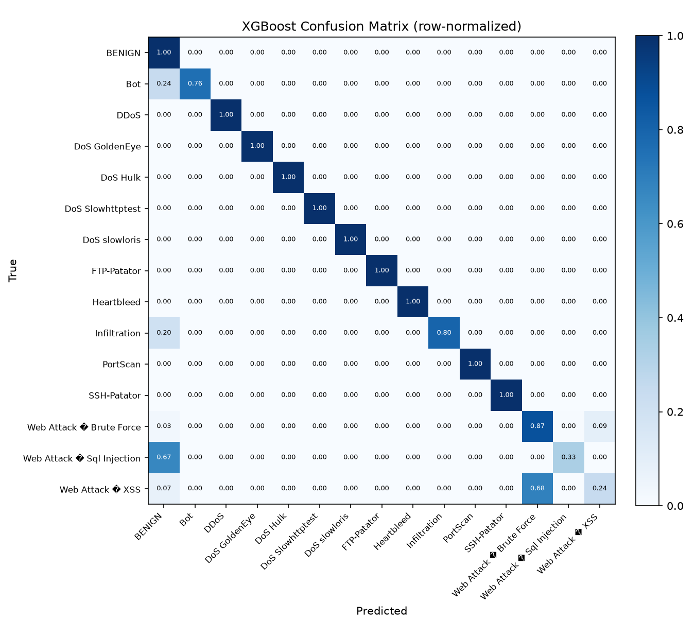
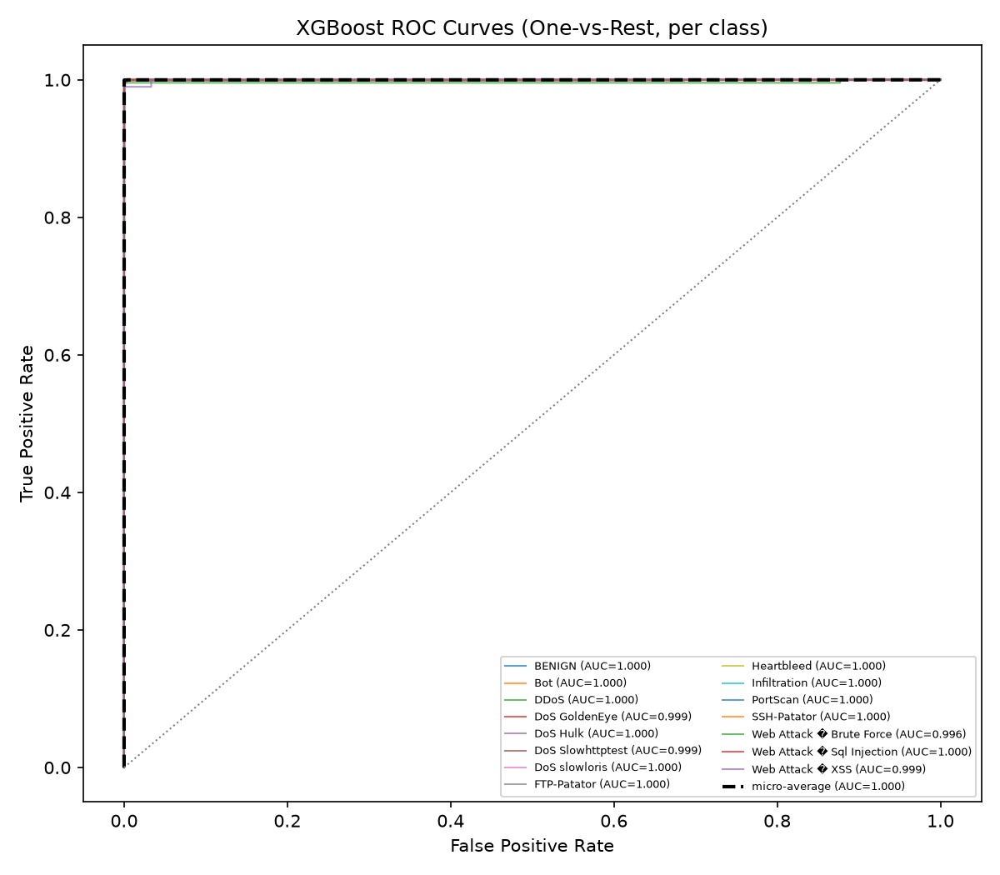
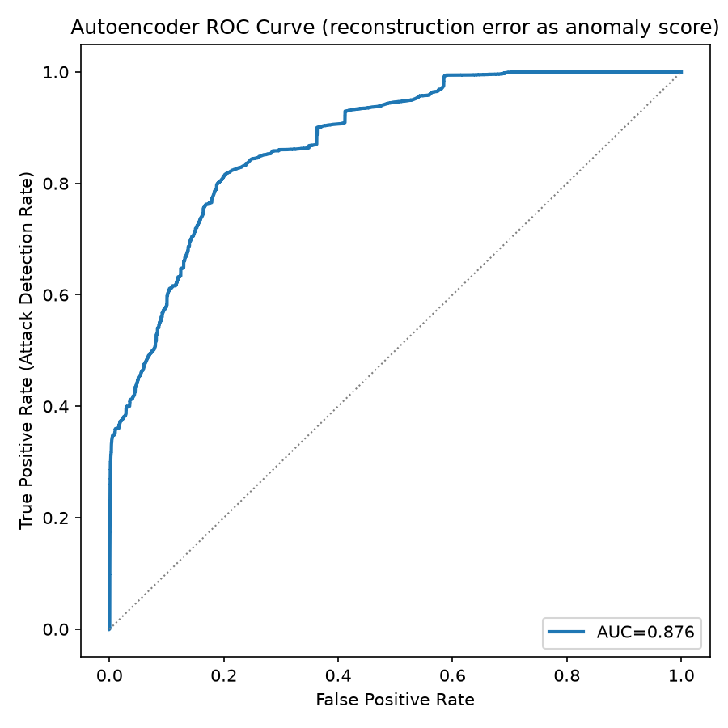
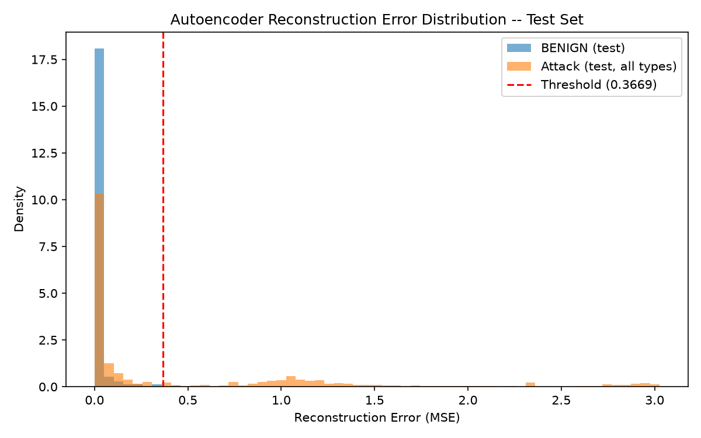

# Verit NIDS - Hybrid Model Evaluation Report

Dataset: `Database/all_data_combined.csv`  

Total rows loaded: 2830743  

Split sizes -- train: 1563365, val: 424612, test: 424612


## Class distribution (full dataset)

| Class | Count | % of total |
|---|---|---|
| BENIGN | 2273097 | 80.30% |
| DoS Hulk | 231073 | 8.16% |
| PortScan | 158930 | 5.61% |
| DDoS | 128027 | 4.52% |
| DoS GoldenEye | 10293 | 0.36% |
| FTP-Patator | 7938 | 0.28% |
| SSH-Patator | 5897 | 0.21% |
| DoS slowloris | 5796 | 0.20% |
| DoS Slowhttptest | 5499 | 0.19% |
| Bot | 1966 | 0.07% |
| Web Attack � Brute Force | 1507 | 0.05% |
| Web Attack � XSS | 652 | 0.02% |
| Infiltration | 36 | 0.00% |
| Web Attack � Sql Injection | 21 | 0.00% |
| Heartbleed | 11 | 0.00% |

## XGBoost (Known-Attack Classifier) -- Test Set Results

```
                            precision    recall  f1-score   support

                    BENIGN       1.00      1.00      1.00    340965
                       Bot       0.80      0.76      0.78       295
                      DDoS       1.00      1.00      1.00     19204
             DoS GoldenEye       1.00      1.00      1.00      1544
                  DoS Hulk       1.00      1.00      1.00     34661
          DoS Slowhttptest       0.95      1.00      0.97       825
             DoS slowloris       0.99      1.00      0.99       869
               FTP-Patator       1.00      1.00      1.00      1191
                Heartbleed       1.00      1.00      1.00         2
              Infiltration       0.80      0.80      0.80         5
                  PortScan       0.99      1.00      1.00     23839
               SSH-Patator       1.00      1.00      1.00       885
  Web Attack � Brute Force       0.72      0.87      0.79       226
Web Attack � Sql Injection       0.50      0.33      0.40         3
          Web Attack � XSS       0.52      0.24      0.33        98

                  accuracy                           1.00    424612
                 macro avg       0.88      0.87      0.87    424612
              weighted avg       1.00      1.00      1.00    424612

```






### Per-class AUC

| Class | AUC |
|---|---|
| BENIGN | 0.9999 |
| Bot | 0.9999 |
| DDoS | 1.0000 |
| DoS GoldenEye | 0.9994 |
| DoS Hulk | 1.0000 |
| DoS Slowhttptest | 0.9991 |
| DoS slowloris | 1.0000 |
| FTP-Patator | 0.9996 |
| Heartbleed | 1.0000 |
| Infiltration | 1.0000 |
| PortScan | 0.9999 |
| SSH-Patator | 1.0000 |
| Web Attack � Brute Force | 0.9960 |
| Web Attack � Sql Injection | 1.0000 |
| Web Attack � XSS | 0.9995 |
| __micro_average__ | 1.0000 |

### Error Analysis -- XGBoost

**Top confused class pairs (true → predicted):**

| True Class | Predicted As | Count | % of True Class |
|---|---|---|---|
| BENIGN | PortScan | 140 | 0.0% |
| Bot | BENIGN | 72 | 24.4% |
| Web Attack � XSS | Web Attack � Brute Force | 67 | 68.4% |
| BENIGN | Bot | 57 | 0.0% |
| BENIGN | DoS Slowhttptest | 41 | 0.0% |
| BENIGN | DoS Hulk | 37 | 0.0% |
| DoS Hulk | BENIGN | 36 | 0.1% |
| Web Attack � Brute Force | Web Attack � XSS | 21 | 9.3% |
| Web Attack � Brute Force | BENIGN | 7 | 3.1% |
| Web Attack � XSS | BENIGN | 7 | 7.1% |
| BENIGN | Web Attack � Brute Force | 6 | 0.0% |
| PortScan | DoS Hulk | 5 | 0.0% |
| BENIGN | DoS slowloris | 4 | 0.0% |
| BENIGN | DDoS | 3 | 0.0% |
| DoS GoldenEye | BENIGN | 3 | 0.2% |

**Classes with recall < 0.80 AND fewer than 200 training samples (the most likely explanation for their errors is simply insufficient training data, not a fundamental feature limitation):**

| Class | Recall | Training-set-relative sample count |
|---|---|---|
| Web Attack � Sql Injection | 0.333 | 21 |

## Autoencoder (Zero-Day / Anomaly Detector) -- Test Set Results

Anomaly threshold (from validation, p99.0): 0.366858

ROC-AUC (benign vs. all attacks, reconstruction error as score): 0.8761






### Per-class detection / false-positive rate

| Class | Role | Rate | Mean Reconstruction Error | n samples (test) |
|---|---|---|---|---|
| FTP-Patator | detection_rate | 0.000 | 0.013018 | 1191 |
| SSH-Patator | detection_rate | 0.000 | 0.004089 | 885 |
| Web Attack � Sql Injection | detection_rate | 0.000 | 0.003762 | 3 |
| PortScan | detection_rate | 0.000 | 0.040620 | 23839 |
| Bot | detection_rate | 0.007 | 0.014631 | 295 |
| Web Attack � XSS | detection_rate | 0.010 | 0.012332 | 98 |
| Web Attack � Brute Force | detection_rate | 0.040 | 0.021125 | 226 |
| DoS GoldenEye | detection_rate | 0.225 | 0.381865 | 1544 |
| DoS Slowhttptest | detection_rate | 0.354 | 0.627864 | 825 |
| DDoS | detection_rate | 0.372 | 0.517376 | 19204 |
| DoS slowloris | detection_rate | 0.383 | 0.422667 | 869 |
| Infiltration | detection_rate | 0.400 | 337.469452 | 5 |
| DoS Hulk | detection_rate | 0.616 | 1.196035 | 34661 |
| Heartbleed | detection_rate | 1.000 | 1.818746 | 2 |
| BENIGN | false_positive_rate | 0.010 | 0.037026 | 340965 |

### Error Analysis -- Autoencoder

Attack types the autoencoder catches poorly (detection rate < 50%) -- these attack types' flow statistics apparently resemble normal traffic closely enough that reconstruction error alone doesn't separate them. This is expected and is exactly why the hybrid design pairs this model with the supervised XGBoost classifier above, which can be trained explicitly on these classes if they're known attack types:

- **FTP-Patator** (1191 test samples): 0.0% detected, mean error 0.013018 vs. threshold 0.366858
- **SSH-Patator** (885 test samples): 0.0% detected, mean error 0.004089 vs. threshold 0.366858
- **Web Attack � Sql Injection** (3 test samples): 0.0% detected, mean error 0.003762 vs. threshold 0.366858
- **PortScan** (23839 test samples): 0.0% detected, mean error 0.040620 vs. threshold 0.366858
- **Bot** (295 test samples): 0.7% detected, mean error 0.014631 vs. threshold 0.366858
- **Web Attack � XSS** (98 test samples): 1.0% detected, mean error 0.012332 vs. threshold 0.366858
- **Web Attack � Brute Force** (226 test samples): 4.0% detected, mean error 0.021125 vs. threshold 0.366858
- **DoS GoldenEye** (1544 test samples): 22.5% detected, mean error 0.381865 vs. threshold 0.366858
- **DoS Slowhttptest** (825 test samples): 35.4% detected, mean error 0.627864 vs. threshold 0.366858
- **DDoS** (19204 test samples): 37.2% detected, mean error 0.517376 vs. threshold 0.366858
- **DoS slowloris** (869 test samples): 38.3% detected, mean error 0.422667 vs. threshold 0.366858
- **Infiltration** (5 test samples): 40.0% detected, mean error 337.469452 vs. threshold 0.366858

Benign false-positive rate on the test set: 1.00% (calibrated at the p99.0 threshold from validation data -- raise this percentile to trade detection sensitivity for fewer false alarms, or lower it for the opposite trade-off).
